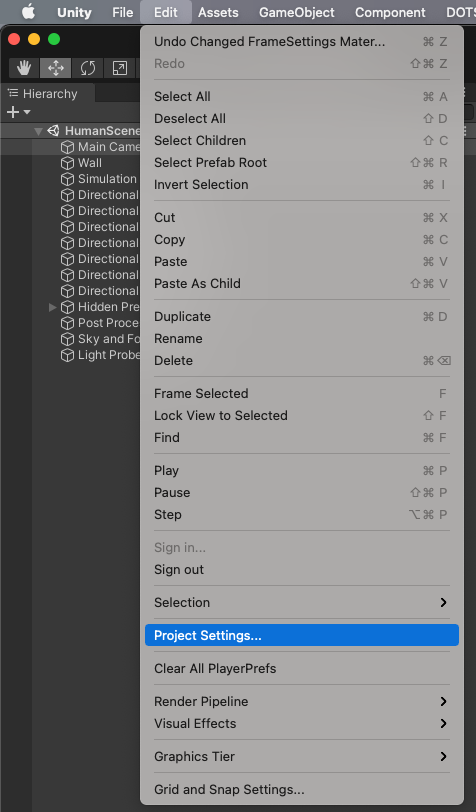
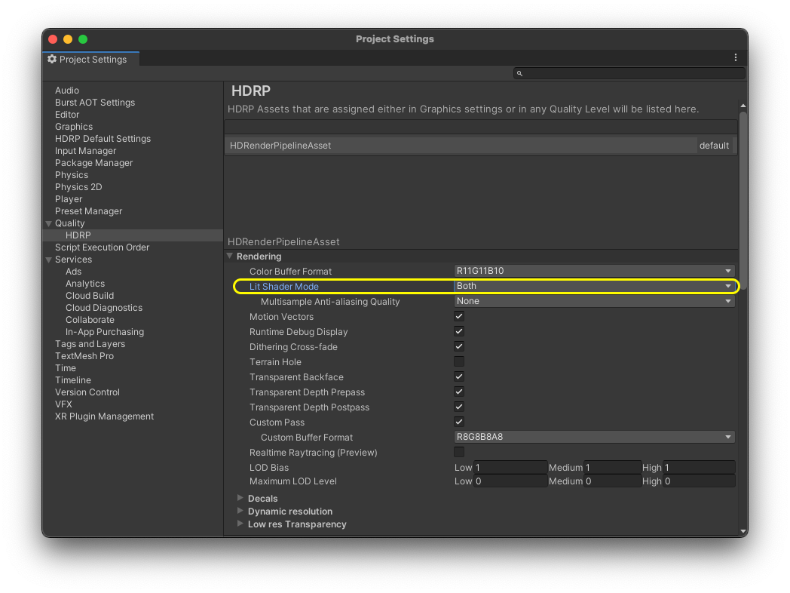
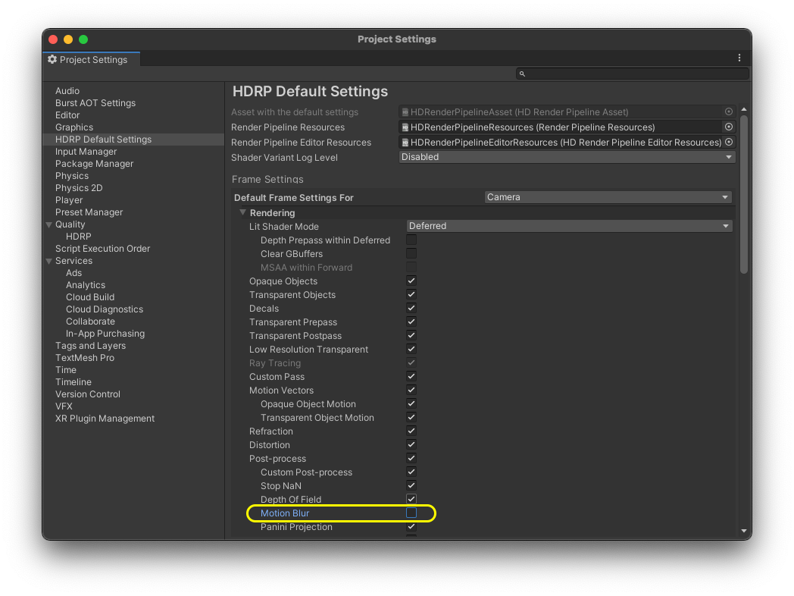
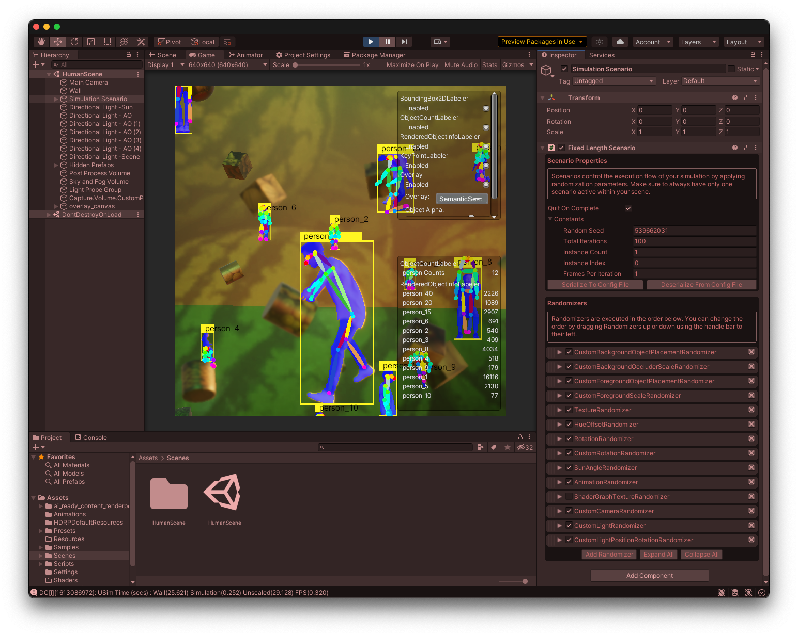

# PeopeSansPeople Unity Environment Template

&nbsp;

&nbsp;

---

This repository provides the **PeopleSansPeople** Unity environment template in HDRP. The project includes custom randomizers and a few sample human assets provided courtesy of Unity Technologies. 
This environment still provides the full functionality of the **PeopleSansPeople** explained in our paper and the Linux and macOS binary files we have provided. In lieu of 3rd party assets for which we do not own redistribution license, we provide the following example assets/content:
   - 4 Unity-branded assets with different clothing colour but the same appearance.
   - 529 Unity groceries textures.
   - 8 Unity-owned animation clips.  

The purpose of this Unity environment is to enable the community to get started with building their own version of a human-centric data generator, by lowering the barrier of entry and providing them with the full functionalities that exist in **PeopleSansPeople**. The users can easily swap the assets and content in this project with their own assets, so long as their properties match those of the example assets we have provided.

## Getting started

- The project relies on Unity version `2020.3.20f1` and Perception package `0.9.0-preview.2`.

- Currently, all necessary packages come pre-installed with this project, which allows you to press play and expect synth data generation without any extra steps. The synthetic data will be a set of images, semantic/instance segmentations, and annotations containing bounding box and keypoint labels.

- A sample scene named **HumanScene** containing necessary game objects for demoing the custom randomizers has been provided.

- By default all randomizers are enabled in the `Simulation Scenario`.

## Cloning via Command Line

Prior to cloning via command line, ensure that you have [Git LFS](https://docs.github.com/en/github/managing-large-files/installing-git-large-file-storage) installed, otherwise large files will not download correclty.

## Running the simulation in Unity

After cloning the project, open it in Unity version `2020.3.20f1`. Then in the `Project` window open `Assets/Scenes` and then double-click on `HumanScene.unity` to open the sample provided scene.

Before running the simulation:
   
   1. From the menu bar open `Edit > Project Settings`.
   
   
   
   2. In `Project Settings` search for `Lit Shader Mode` and set it to `Both`.
   
    
   2. In `Project Settings` search for `Motion Blur` and disable it.
   
   
You can then start running the simulation, and should expect randomly generated images with annotations like the ones shown in the example frame below.

## Converting the simulation's generated data to COCO

After your dataset is generated, locate the folder where the data is stored -- this is displayed under the `Hierarchy > HumanScene > Main Camera` in the inspector tab as `Latest Generated Dataset`, and also printed to the console in the Unity editor. Then follow Unity's [datasetinsights](https://github.com/Unity-Technologies/datasetinsights) instructions for installation. Finally, refer to [conversion instructions](https://github.com/Unity-Technologies/datasetinsights#convert-datasets) to convert your data into a COCO-compatible annotation format.

## License
PeopleSansPeople is licensed under the Apache License, Version 2.0. See [LICENSE](https://github.com/Unity-Technologies/PeopleSansPeople/blob/main/LICENSE.md) for the full license text.
